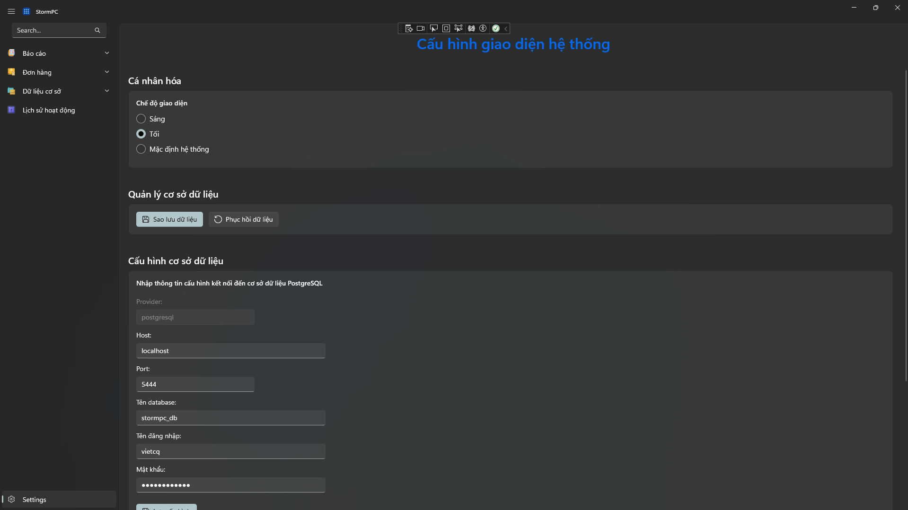
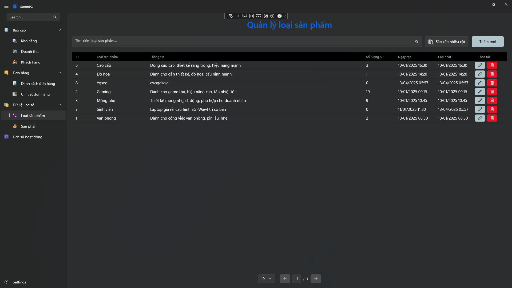
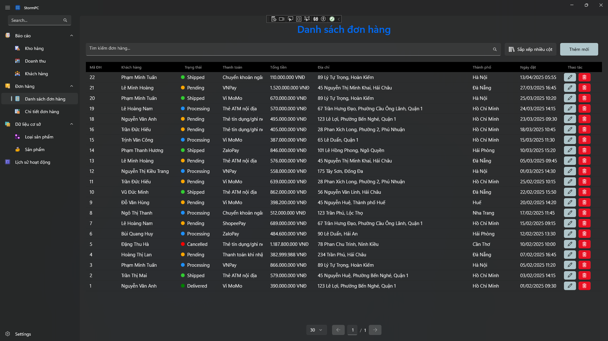
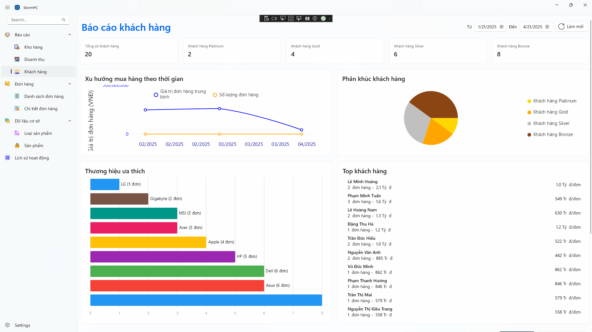
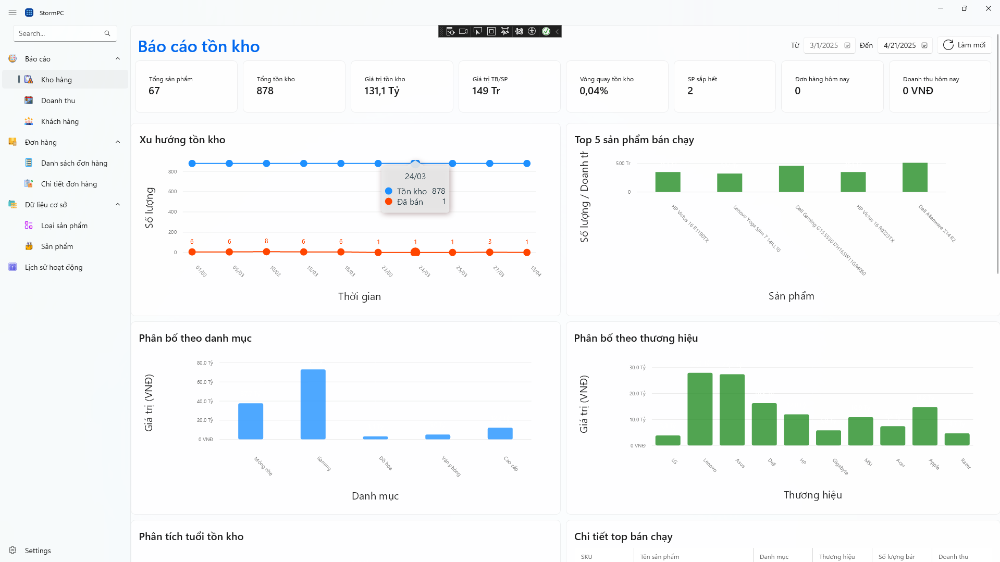
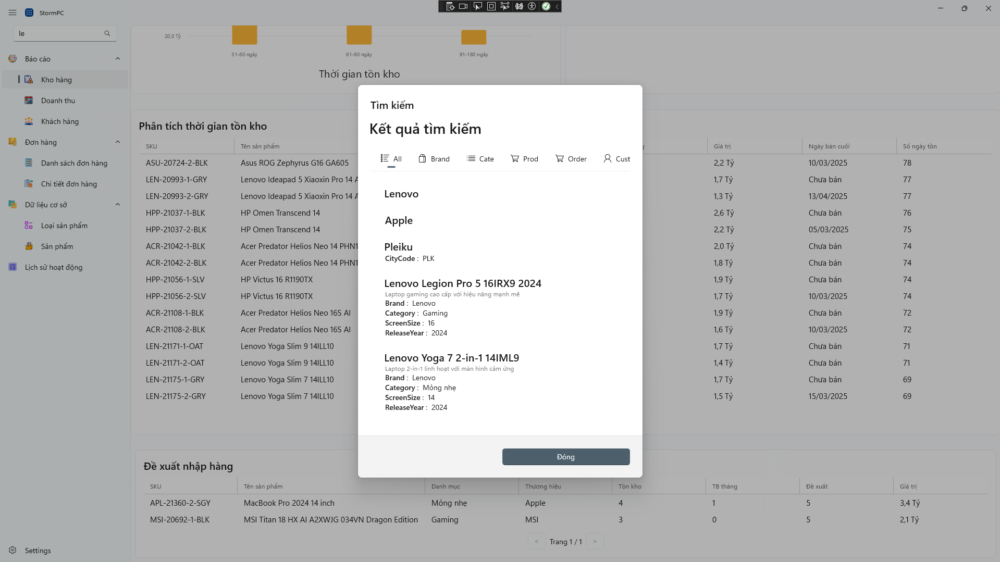

<p align="right">
  <a href="README.vi.md"></a>
  &nbsp;|&nbsp;
  <a href="README.md"></a>
</p>

# STORMPC 2024


## Video Demo and Tutorial
- Detailed feature demo: [YouTube - Demo StormPC](https://youtu.be/dRkxu4bkW9A)
- Application installation guide: See video in `/output_stormpc/Final_QL2_release.mp4` folder

## A. Installation from Installer
1. Navigate to `/output_stormpc/StormPC_1.0.6.2_Debug_Test` folder
2. See detailed instructions from the attached video

## B. Running from Source Code

### 1. System Requirements
- Windows 10/11
- .NET 8.0 SDK
- Docker Desktop
- Visual Studio 2022

### 2. Starting PostgreSQL Database
1. Open Command Prompt or PowerShell
2. Navigate to project directory:  
   ```
   cd path\DoAn_UDQL2\DataBase
   ```
3. Run Docker Compose command:  
   ```
   docker-compose -f docker-compose.yml up -d
   ```
4. Verify container is running successfully:
   ```
   docker ps
   ```
   (You should see container named `stormpc_container` running)

### 3. Database Connection Configuration
1. In the `StormPC/StormPC.Core` folder, check the `.env` file with the following configuration:
   ```
   DB_PROVIDER=postgresql
   DB_HOST=localhost
   DB_PORT=5444
   DB_NAME=stormpc_db
   DB_USER=vietcq
   DB_PASSWORD=123456789000
   ```
2. If the `.env` file doesn't exist, create a new one from the `.env.example` file

### 4. Initialize Sample Data
1. Open terminal in the `DataBase` folder
2. Run command to create database structure:
   ```
   npx sequelize-cli db:migrate
   ```
3. Run command to add sample data:
   ```
   npx sequelize-cli db:seed:all
   ```
> ⚠️ **Note:** Ensure the environment has nodejs to run Sequelize CLI

### 5. Launch Application (Debug Mode)
1. Open the solution file `StormPC.sln` with Visual Studio 2022
2. Set `StormPC` as Startup Project (right-click > Set as Startup Project)
3. Select Debug configuration and x64 platform
4. Press `F5` or click `Start` button to run the application
5. On first run, you will be prompted to set up an admin account

## C. Troubleshooting

### Database Connection Errors
1. Check if Docker is running
2. Verify database container is active:
   ```
   docker ps | findstr stormpc
   ```
3. Check connection information in `.env` matches `docker-compose.yml`
4. If needed, restart container:
   ```
   docker-compose -f docker-compose.yml down
   docker-compose -f docker-compose.yml up -d
   ```

### Application Startup Errors
1. Ensure .NET 8.0 SDK is installed
2. Clean and rebuild solution:
   ```
   dotnet clean StormPC.sln
   dotnet build StormPC.sln
   ```
3. Check error logs in Visual Studio Output window

## D. Main Features
- Secure login with Argon2id encryption
- System overview dashboard
- Product management (laptops) with detailed technical specifications
- Order management and payment processing
- Revenue and inventory statistical reports
- Customer management and group classification
- Advanced multi-criteria search
- Data backup and restore
- Responsive interface with dark mode support

> ⚠️ **Note:** Running the application in Debug mode ensures full functionality. The release version may have some limitations due to the Windows environment. Runtime errors for production environment have not been fixed yet.


## 🖥️ Interface and Feature Demo

### 1. Interface Settings (Dark Mode)
  
*Settings page with dark mode, allowing users to customize the interface according to their preferences*

### 2. Activity Log
  
*Track and record all user activities in the system*

### 3. Product Management
  
*Laptop management interface with detailed information and CRUD operations*

### 4. Category Management
  
*Manage product categories, classifying laptops by groups*

### 5. Order List
  
*Display all orders with status and overview information*

### 6. Order Details
  
*View order details including products, quantities, prices, and customer information*

### 7. Customer Report
  
*Statistical reports about customers with visual charts*

### 8. Customer Report Table
  
*Detailed data table about customer information and purchasing activities*

### 9. Revenue Report
  
*Revenue statistics charts over time with multiple display formats*

### 10. Inventory Report
  
*Inventory status report with analytical charts*

### 11. Inventory Report Table
  
*Detailed data table about inventory quantities for each product*

### 12. Advanced Search
  
*Multi-criteria search functionality with detailed filters*

---